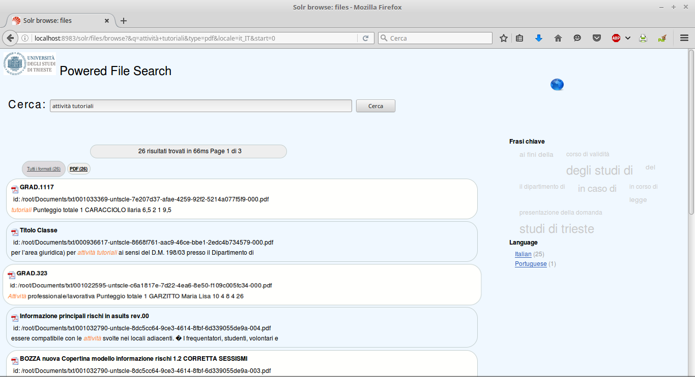
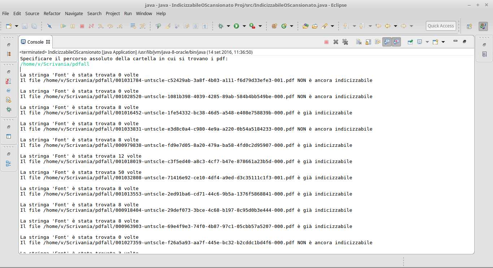
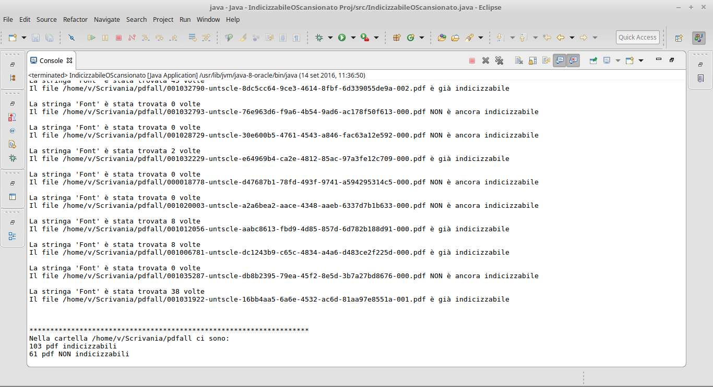
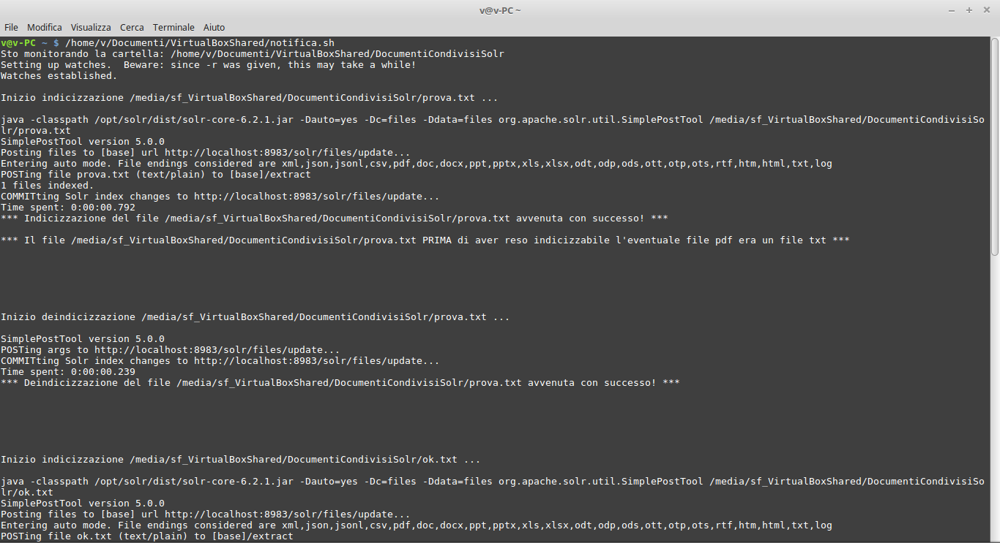
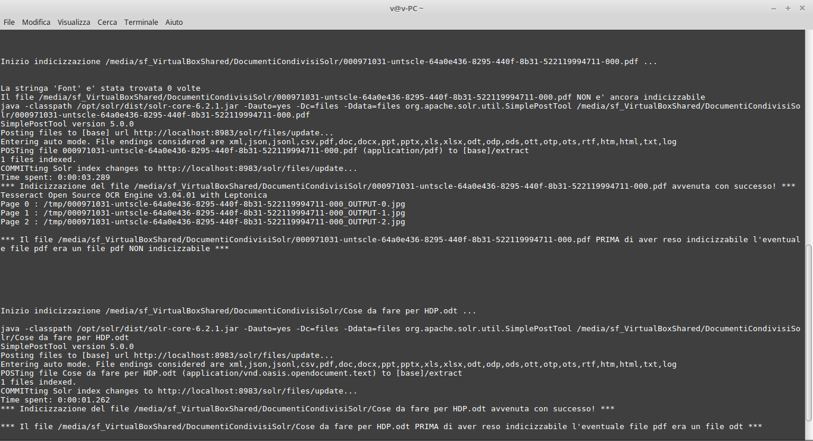
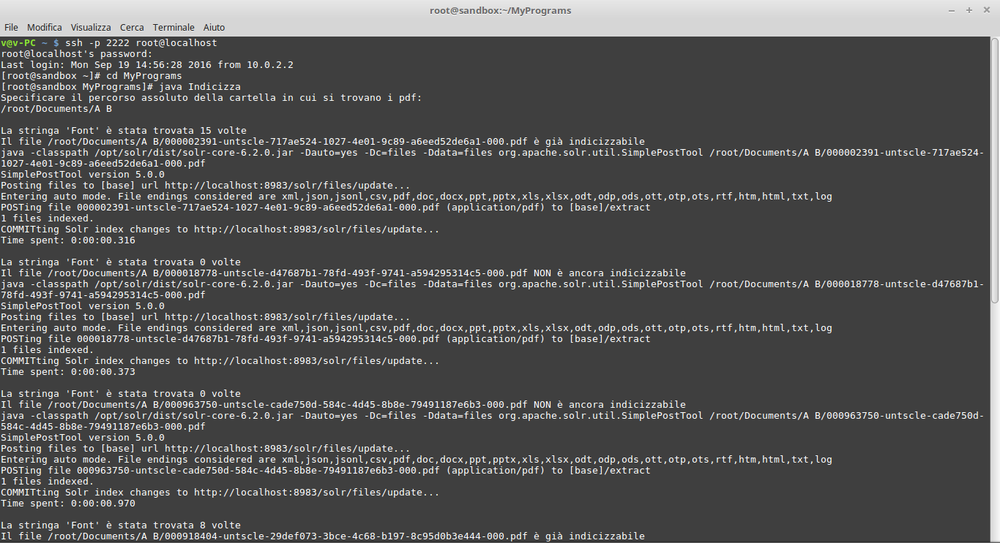
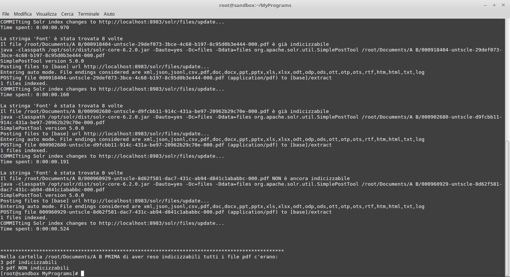
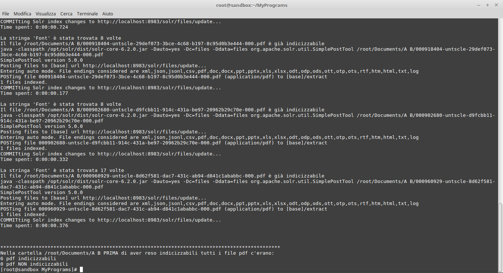

# Analysis of the Indexing and Document Search Functionalities of the Apache Solr Platform

This project aims to analyze the functionalities of indexing and searching documents on the Apache Solr platform, an open-source document search engine. The project includes configuring a prototype of Apache Solr and implementing several scripts, a Java program, and a UI Solritas to perform the following tasks:

1. Real-time detection of changes in a folder containing documents
2. Identification of non-indexable PDF files
3. Making the PDF files indexable for content using OCR
4. Indexing the PDF files using Apache Solr
5. Performing searches on the indexed files, preferably with a graphical interface

## Project Description
The project's aim is to configure a prototype of Apache Solr and develop a set of scripts, a Java program, and a UI Solritas to index and search documents. The main parts are:

1. Real-time detection of changes in a folder containing documents
	* This task is performed by a script that monitors the folder and detects any file creation, modification, deletion, or movement.
2. Identification of non-indexable PDF files
	* This task is performed by a script that identifies PDF files that cannot be indexed because of missing text content.
3. Making the PDF files indexable for content
	* This task is performed by a script that uses Optical Character Recognition (OCR) technology to extract text from PDF files that cannot be indexed.
4. Indexing the PDF files using Apache Solr
	* This task is performed by a Java program that indexes the PDF files on the Apache Solr platform.
5. Performing searches on the indexed files, preferably with a graphical interface
	* This task is performed by a UI Solritas that allows users to search the indexed files using a graphical interface.

## Screenshots
Below are some screenshots (in Italian) of the different components used in the project:

### UI Solritas

### Java Indexer

### Solr Index Updater

### Indexer

